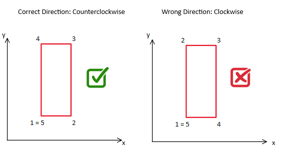
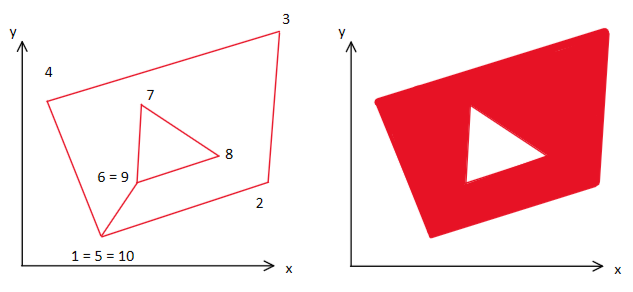
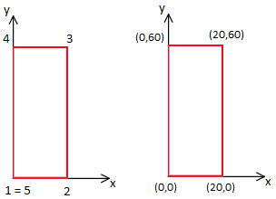
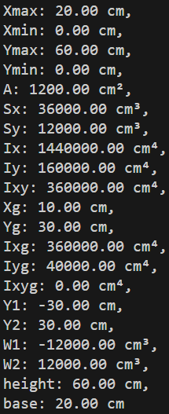
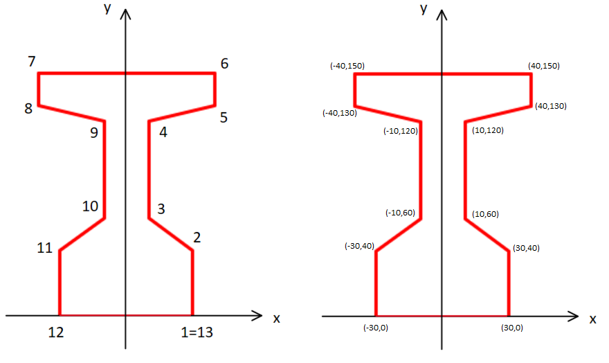
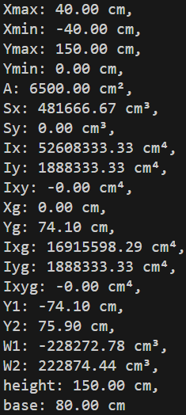
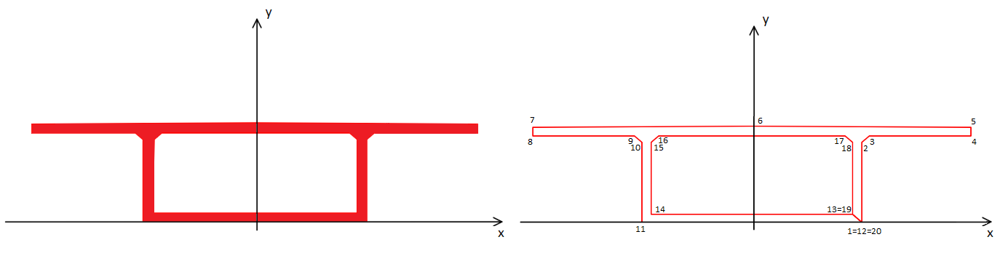
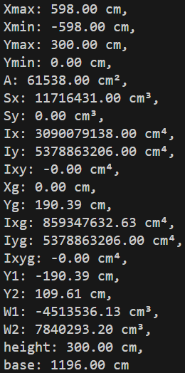
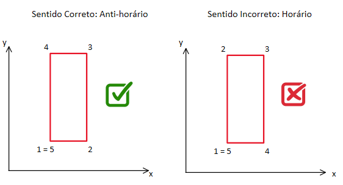

This documentation is available in Portuguese (pt-br) and English (en). If you want to access it in English continue reading, but if you want to access it in Portuguese, <a href="#portuguese-title">click here</a>.
This file is for those who want to delve deeper into the development of the library, if you just want to consume the application, consider reading the simplified documentation present at: <a href="https://www.npmjs.com/package/geometric-props">click here</a>.

<br>

<h1 id='english-title'>Geometric Properties</h1>

This documentation aims to provide context regarding the <i>geometric-props</i> project. The project is also available on npm, where the project in production are provided. To access, <a href="https://www.npmjs.com/package/geometric-props">click here</a>.

<ol>
  <li><a href='#project'>What's the project / project objectives</a></li>
  <li><a href='#introduction'>Introduction</a></li>
  <li><a href='#file-system'>File System</a></li>
  <li><a href='#execute'>How to execute the application</a></li>
  <li><a href='#tecnologies'>Used Technologies</a></li>
  <li><a href='#examples'>Examples</a></li>
  <li><a href='#license'>License</a></li>
  <li><a href='#authors'>Authors<a></li>
  <li><a href='#reference'>Bibliographic references</a></li>
</ol>

<br>

<h2 id='project'>1 - What's the project / project objectives</h2>

The project aims to calculate a set of geometric properties of polygonal figures inserted in a two-dimensional plane. In this project, a class is implemented using the Javascript programming language that abstracts the methodology used in Green's theorem, which transforms surface integrals into line integrals along a contour to calculate the following geometric properties:

Note: The units provided in the table are valid when entering the coordinates of the polygonal figure in centimeters (cm).


| Geometric Propertie                                                                           | Acronym        | Unit    |
| :---                                                                                          | :---:          | :---:   |
| Section area                                                                                  | A              | cm²     |
| Static moment with respect to the x-axis                                                      | S<sub>x</sub>  | cm³     |
| Static moment with respect to the y-axis                                                      | S<sub>y</sub>  | cm³     |
| Moment of inertia with respect to the x-axis                                                  | I<sub>x</sub>  | cm⁴     |
| Moment of inertia with respect to the y-axis                                                  | I<sub>y</sub>  | cm⁴     |
| Product of inertia with respect to the x and y axes                                           | I<sub>xy</sub> | cm⁴     |
| Centroid of the section relative to the x-axis                                                | x<sub>g</sub>  | cm      |
| Centroid of the section relative to the y-axis                                                | y<sub>g</sub>  | cm      |
| Barycentric moment of inertia (with respect to the centroid) on the x-axis                    | I<sub>xg</sub> | cm⁴     |
| Barycentric moment of inertia (with respect to the centroid) on the y-axis                    | I<sub>yg</sub> | cm⁴     |
| Vertical distance between the center of gravity and the lowest point along the vertical axis  | Y<sub>1</sub>  | cm      |
| Vertical distance between the highest point along the vertical axis and the center of gravity | Y<sub>2</sub>  | cm      |
| Resistant modulus, calculated considering Y<sub>1</sub>                                       | W<sub>1</sub>  | cm³     |
| Resistant modulus, calculated considering Y<sub>2</sub>                                       | W<sub>2</sub>  | cm³     |
| Height                                                                                        | height         | cm      |

<br>

<p>In addition, the application also allows you to obtain some more relevant information, such as:</p>

| Information                                   | Acronym         | Unit    |
| :---                                          | :---:           | :---:   |
| Maximum coordinate with respect to the x axis | x<sub>max</sub> | cm      |
| Minimum coordinate with respect to the x axis | x<sub>min</sub> | cm      |
| Maximum coordinate with respect to the y axis | y<sub>max</sub> | cm      |
| Minimum coordinate with respect to the x axis | y<sub>min</sub> | cm      |

<br>

<h2 id='introduction'>2 - Introduction</h2>

<p>The application allows you to work with hollow figures, but you must pay attention to the following precautions, the insertion of a section takes place as the vertices are inserted in a counterclockwise direction, while the removal of a section takes place as its vertices are inserted clockwise.</p>

<p>In the following introductory example, we want to calculate the properties of a figure with 4 vertices; this figure does not have a hollow section (its section is solid). Care must be taken with the order in which the vertices are inserted. The first point is marked with the number 1, the second with the number 2, and so on. Note that it is necessary to reinsert the starting point, such that the x and y axis coordinates of the first point and the last point are the same. In the following image, on the left an image is shown that indicates the correct order of insertion of the points, on the right we have an example of a common error which is using the wrong direction when inserting the points.</p>




<br>
Next, a figure will be presented in which its section is hollowed out, in this case, the order of the points will be:

<br>



<br>

<h2 id='file-system'>3 - File System</h2>

In the project, there are 5 folders that will be mentioned later and the documentation files <i>README.md</i>, the dependency configuration file <i>package.json</i>, the file with instructions for the compiler <i>tsconfig.json</i> and other configuration files for babel <i>babel.config.js</i> and jest <i>jest.config.js</i>

```
├── dist
│ ├── GeometricProps.js
│ ├── index.js
│ └── ...
├── examples
│ ├── exemple01.js
│ ├── example02.js
│ └── example03.js
├── images
│ └── ...
├── src
│ ├── interfaces
│ └── GeometricProps.ts
├── __tests__
│ ├── examples
│ └── rectangule.ts
├── utils
│ ├── ...
├── README.MD
├── babel.config.js
├── jest.config.js
```

<h3>Folders:</h3>


<b>`dist:`</b> In this folder are the already compiled project files, from typescript to javascript, the class for calculating geometric properties is GeometricProps.js, but we are using barrel export, making all files can be imported based only on the library name when using the project via npm, given the `main` key in `package.json` pointing to the application's main file. If the download is via github, with the complete project, you must reference the index file in the dist folder to import the files of interest<br>

<b>`examples:`</b> This folder contains the examples that are in topic 6, example 1 for the rectangular section, example 2 for the T section with corbels and example 3 for the box section<br >

<b>`images:`</b> This folder contains the images that were inserted in README.MD, they are images for explanatory purposes only and are not used in the application.<br>

<b>`src:`</b> This folder contains the class for calculating the geometric properties and the respective necessary interfaces, in this case, we have the project in typescript, the class for calculating the geometric properties is GeometricProps.ts

<b>`__tests__:`</b> Folder with the application tests using jest, the tests are configured to work on all files with the ts extension, a script is inserted in the package.json file to run this scan

<b>`utils:`</b> Folder with files containing functions that will be used in various places in the project

<br>

<h2 id='execute'>4 - How to execute the aplication</h2>

In this project, we are using <i>barrel export</i> which means all files can be imported just based on the index file inside the dist folder. 

The first step to running the application is to import the class contained in the <i>geometricProps.js</i> file, also available through the index.js file. For example, if the class instance is contained in the examples folder, you must insert:

```
import GeometricProps from "../dist/index.js";
```

The next step is to create an instance of the class, in this case, no arguments from a vector of objects are expected, each object must contain the x property, which references the coordinate on the x axis, and must also contain the y property, which does coordinate reference on the y axis. Each vertex of the figure is related to a position in the vector, which contains an object that requires the position of the vertex in relation to the x-axis and in relation to the y-axis. When instantiating a class, the following structure must be provided:

In the following case, we want to represent a rectangular figure with a base of 20cm and a height of 60cm, in which the lower left corner is located in the geographic regions (0,0). The following table and figure represent the situation in question:

| Point  | Coordinate on x axis | Coordinate on y axis |
| :---:  | :---:                | :---:                |
| 1      | 0                    | 0                    |
| 2      | 20                   | 0                    |
| 3      | 20                   | 60                   |
| 4      | 0                    | 60                   |
| 5      | 0                    | 0                    |

<br>

The illustrative image that represents the situation described in the table is presented below:

  


<br>

After importing the class, you must create an instance and assign it to a variable. In this case, the variable <code>rectangulo</code> will be created and assigned to the instance of the class that expects to receive in its constructor, a vector indicated by <code>[]</code> and each position of this vector must be an object indicated by <code>{}</code>. Within this dictionary, a key set will be inserted, a value that references the axis (x or y) and the reference value.

```
const rectangulo = new GeometricProps(
    [
        {'x':0, 'y':0},           //ponto 1
        {'x':20, 'y':0},          //ponto 2
        {'x':20, 'y':60},         //ponto 3
        {'x':0, 'y':60},          //ponto 4
        {'x':0, 'y':0}            //ponto 5
    ])
```
  
After having instantiated the class correctly, it is now possible to access all the properties described in the geometric properties table, each geometric property is a respective property of the class. Next, the name of the class property and its corresponding geometric property will be presented.

<h3>Name of the geometric property and respective class property:</h3>

<table border="1">
  <thead>
  <th>Geometric Property</th>
    <th>Class property</th>
  </thead>

  <tbody>
    <tr>
      <td>Section area (A)</td>
      <td align="center">rectangulo.A</td>
    </tr>
    <tr>
      <td>Static moment with respect to the x-axis (S<sub>x</sub>)</td>
      <td align="center">rectangulo.Sx</td>
    </tr>
    <tr>
      <td>Static moment with respect to the y-axis (S<sub>y</sub>)</td>
      <td align="center">rectangulo.Sy</td>
    </tr>
    <tr>
      <td>Moment of inertia with respect to the x-axis (I<sub>x</sub>)</td>
      <td align="center">rectangulo.Ix</td>
    </tr>
    <tr>
      <td>Moment of inertia with respect to the y-axis (I<sub>y</sub>)</td>
      <td align="center">rectangulo.Iy</td>
    </tr>
    <tr>
      <td>Product of inertia with respect to the x and y axes (I<sub>xy</sub>)</td>
      <td align="center">rectangulo.Ixy</td>
    </tr>
    <tr>
      <td>Centroid of the section relative to the x-axis (x<sub>g</sub>)</td>
      <td align="center">rectangulo.Xg</td>
    </tr>
    <tr>
      <td>Centroid of the section with respect to the y-axis (y<sub>g</sub>)</td>
      <td align="center">rectangulo.Yg</td>
    </tr>
    <tr>
      <td>Barycentric moment of inertia (with respect to the centroid) on the x-axis (I<sub>xg</sub>)</td>
      <td align="center">rectangulo.Ixg</td>
    </tr>
    <tr>
      <td>Barycentric moment of inertia (with respect to the centroid) on the y-axis (I<sub>yg</sub>)</td>
      <td align="center">rectangulo.Iyg</td>
    </tr>
    <tr>
      <td>Product of inertia with respect to the centroid in x and y (I<sub>xyg</sub>)</td>
      <td align="center">rectangulo.Ixyg</td>
    </tr>
    <tr>
      <td>Vertical distance between the center of gravity and the lowest point along the vertical axis (Y<sub>1</sub>)</td>
      <td align="center">rectangulo.Y1</td>
    </tr>
    <tr>
      <td>Vertical distance between the highest point along the vertical axis and the center of gravity (Y<sub>2</sub>)</td>
      <td align="center">rectangulo.Y2</td>
    </tr>
    <tr>
      <td>Resistant modulus, calculated considering Y<sub>1</sub> (W<sub>1</sub>)</td>
      <td align="center">rectangulo.W1</td>
    </tr>
    <tr>
      <td>Resistant modulus, calculated considering Y<sub>2</sub> (W<sub>2</sub>)</td>
      <td align="center">rectangulo.W2</td>
    </tr>
    <tr>
      <td>Height (h)</td>
      <td align="center">rectangulo.height</td>
    </tr>
  </tbody>
</table>

<h3>Accessing each geometric property and other information</h3>

Below, the <code>console.log()</code> for each of the geometric properties will be presented. The <code>toFixed()</code> function helps to display the result with 2 decimal places.

```

console.log(`
Xmax: ${rectangulo.Xmax.toFixed(2)} cm,
Xmin: ${rectangulo.Xmin.toFixed(2)} cm,
Ymax: ${rectangulo.Ymax.toFixed(2)} cm,
Ymin: ${rectangulo.Ymin.toFixed(2)} cm,
A: ${rectangulo.A.toFixed(2)} cm²,
Sx: ${rectangulo.Sx.toFixed(2)} cm³,
Sy: ${rectangulo.Sy.toFixed(2)} cm³,
Ix: ${rectangulo.Ix.toFixed(2)} cm⁴,
Iy: ${rectangulo.Iy.toFixed(2)} cm⁴,
Ixy: ${rectangulo.Ixy.toFixed(2)} cm⁴,
Xg: ${rectangulo.Xg.toFixed(2)} cm,
Yg: ${rectangulo.Yg.toFixed(2)} cm,
Ixg: ${rectangulo.Ixg.toFixed(2)} cm⁴,
Iyg: ${rectangulo.Iyg.toFixed(2)} cm⁴,
Ixyg: ${rectangulo.Ixyg.toFixed(2)} cm⁴,
Y1: ${rectangulo.Y1.toFixed(2)} cm,
Y2: ${rectangulo.Y2.toFixed(2)} cm,
W1: ${rectangulo.W1.toFixed(2)} cm³,
W2: ${rectangulo.W2.toFixed(2)} cm³,
height: ${rectangulo.height.toFixed(2)} cm,
base: ${rectangulo.base.toFixed(2)} cm,
`)
```

<br>

<h2 id='tecnologies'>5 - Used Tecnologies</h2>

TypeScript, Jest, Babel, eslint

<br>

<h2 id='examples'>6 - Examples</h2>

In this topic, typical examples of sections used in structural systems of steel and wood, reinforced concrete and prestressed concrete will be presented, that is, applied in the context of Civil engineering and Mechanical engineering (the names of the sections will be typical of these areas of knowledge). The results will be presented with 2 decimal places for teaching purposes.

All examples presented in this topic are available in the application, if you have any questions about how to access the examples, consult the <i>file system topic</i>.

<br>

<h3> 6.1 - Rectangular Section</h3>
 The first example will be the rectangular section presented in the topic 'How to run the application', in this example the image that describes the rectangular polygon will be redisplayed and the results of the geometric properties will also be presented.

<br>


<br>

The terminal image is shown below:

<br>



<br>

<h3> 6.2 - T section with corbels</h3>

In this next section, a conventional polygon for prestressed concrete is presented, which is the T section with corbels. In this case we will have the following points:   



<br>

The code presented for the polygon in question is shown below:

```
const sectionTWithCorbels = new GeometricProps(
    [
        {'x':30, 'y':0}, 
        {'x':30, 'y':40},
        {'x':10, 'y':60},
        {'x':10, 'y':120},
        {'x':40, 'y':130},
        {'x':40, 'y':150},
        {'x':-40, 'y':150},
        {'x':-40, 'y':130},
        {'x':-10, 'y':120},
        {'x':-10, 'y':60},
        {'x':-30, 'y':40},
        {'x':-30, 'y':0},
        {'x':30, 'y':0},
    ])
```
<br>

The terminal image is shown below:

<br>



<br>

<h3> 6.3 - Coffin Section</h3>

The next section is widely used in prestressed concrete structural systems, and has the characteristic of having a hollow section.



<br>

The coordinates are:

| Point  | Coordinate on the x axis | Coordinate on the y axis |
| :---   | :---:                    | :---:                    |
| 1      | 300                      | 0                        |
| 2      | 300                      | 250                      |
| 3      | 320                      | 270                      |
| 4      | 598                      | 270                      |
| 5      | 598                      | 296                      |
| 6      | 0                        | 300                      |
| 7      | -598                     | 296                      |
| 8      | -598                     | 270                      |
| 9      | -320                     | 270                      |
| 10     | -300                     | 250                      |
| 11     | -300                     | 0                        |
| 12     | 300                      | 0                        |
| 13     | 275                      | 25                       |
| 14     | -275                     | 25                       |
| 15     | -275                     | 250                      |
| 16     | -255                     | 270                      |
| 17     | 255                      | 270                      |
| 18     | 275                      | 250                      |
| 19     | 275                      | 25                       |
| 20     | 300                      | 0                        |

<br>

The class instance code is shown below:

```
const sectionBox = new GeometricProps(
    [
        {'x':300, 'y':0}, 
        {'x':300, 'y':250},
        {'x':320, 'y':270},
        {'x':598, 'y':270},
        {'x':598, 'y':296},
        {'x':0, 'y':300},
        {'x':-598, 'y':296},
        {'x':-598, 'y':270},
        {'x':-320, 'y':270},
        {'x':-300, 'y':250},
        {'x':-300, 'y':0},
        {'x':300, 'y':0},
        {'x':275, 'y':25},
        {'x':-275, 'y':25},
        {'x':-275, 'y':250},
        {'x':-255, 'y':270},
        {'x':255, 'y':270},
        {'x':275, 'y':250},
        {'x':275, 'y':25},
        {'x':300, 'y':0},
    ])
```

<br>

The terminal image is shown below:

<br>


<br>

<h2 id='license'>7 - Used License</h2>

The Creative Common CC BY-NC license is being used in this project. This license allows other people to remix, adapt and create from the work present in this repository, as long as they attribute due authorship or reference in academic works to the authors present in item 8. However, it is not permitted to use this code for commercial purposes without the permission of the authors.

<br>

<h2 id='authors'>8 - Authors</h2>

<h4>Developer: Eng. Bruno Teixeira Santos</h4>
<p>Social Networks:</p>
<a href="https://github.com/Brunoengi">Github:</a> <br>
<a href="https://www.linkedin.com/in/bruno--teixeira/">Linkedin:</a> <br>
<a href="https://www.instagram.com/b.de_bruno/">Instagram:</a> <br>
<a href="https://www.youtube.com/channel/UCini8PeSegCCvsCuzZCfKKA">Youtube:</a> <br>
</p>

<h4>Adviser: Prof. Dr. Mauro de Vasconcellos Real </h4>
<p>Social Networks:</p>
<a href="https://github.com/mvreal">Github:</a> <br>
</p>

<br>

<h2 id='reference'>9 - Bibliographic References</h2>

<p>FILHO, A. C. Dimensionamento e verificação de seções poligonais de concreto armado submetidas à flexão composta oblíqua, Porto Alegre, Universidade Federal do Rio Grande do Sul/RS, 2014.</p>

<br>
<br>

A partir dessa seção, será apresentada a documentação do projeto em português (pt-br).
<br>
<br>


<h1 id='portuguese-title'>Propriedades Geométricas</h1>

Esta documentação tem o objetivo de contextualizar com relação ao projeto  <i>geometric-props-ts</i>. Serão abordados os seguintes tópicos:

<ol>
  <li><a href='#projeto'>O que é / objetivo do projeto</a></li>
  <li><a href='#introducao'>Introdução</a></li>
  <li><a href='#sistema-arquivo'>Sistema de Arquivos</a></li>
  <li><a href='#executar'>Como executar a aplicação</a></li>
  <li><a href='#tecnologias'>Tecnologias Utilizadas</a></li>
  <li><a href='#exemplos'>Exemplos</a></li>
  <li><a href='#licenca'>Licença de Uso</a></li>
  <li><a href='#autores'>Autores</a></li>
  <li><a href='#referencias'>Referências bibliográficas</a></li>
</ol>

<br>

<h2 id='projeto'>1 - O que é / objetivo do projeto</h2>

O projeto tem como objetivo calcular um conjunto de propriedades geométricas de figuras poligonais inseridas em um plano bidimensional. Nesse projeto, implementa-se uma classe utilizando a linguagem de programação Javascript que abstrai a metodologia utilizada no teorema de green, que transforma integrais de superfície em integrais de linha ao longo de um contorno para assim, calcular as seguintes propriedades geométricas:

Observação: As unidades disponibilizadas na tabela são válidas quando se insere as coordenadas da figura poligonal em centímetros (cm).

| Propriedades Geométricas                                                                      | Sigla          | Unidade |
| :---                                                                                          | :---:          | :---:   |
| Área da seção                                                                                 | A              | cm²     |
| Momento estático com relação ao eixo x                                                        | S<sub>x</sub>  | cm³     |
| Momento estático com relação ao eixo y                                                        | S<sub>y</sub>  | cm³     |
| Momento de inércia com relação ao eixo x                                                      | I<sub>x</sub>  | cm⁴     |
| Momento de inércia com relação ao eixo y                                                      | I<sub>y</sub>  | cm⁴     |
| Produto da inércia em relação aos eixos x e y                                                 | I<sub>xy</sub> | cm⁴     |
| Centróide da seção em relação ao eixo x                                                       | x<sub>g</sub>  | cm      |
| Centróide da seção em relação ao eixo y                                                       | y<sub>g</sub>  | cm      |
| Momento de inércia baricêntrica (com relação ao centróide) no eixo x                          | I<sub>xg</sub> | cm⁴     |
| Momento de inércia baricêntrica (com relação ao centróide) no eixo x                          | I<sub>xg</sub> | cm⁴     |
| Distância vertical entre o centro de gravidade e o ponto mais baixo ao longo do eixo vertical | Y<sub>1</sub>  | cm      |
| Distância vertical entre o ponto mais alto ao longo do eixo vertical e o centro de gravidade  | Y<sub>2</sub>  | cm      |
| Módulo resistente, calculado considerando Y<sub>1</sub>                                       | W<sub>1</sub>  | cm³     |
| Módulo resistente, calculado considerando Y<sub>2</sub>                                       | W<sub>2</sub>  | cm³     |
| Altura                                                                                        | height         | cm      |

<br>

Além disso, a aplicação permite também obter mais algumas informações relevantes, como:


| Informação                                    | Sigla           | Unidade |
| :---                                          | :---:           | :---:   |
| Coordenada máxima com relação ao eixo x       | x<sub>max</sub> | cm²     |
| Coordenada mínima com relação ao eixo x       | x<sub>min</sub> | cm      |
| Coordenada máxima com relação ao eixo y       | y<sub>max</sub> | cm      |
| Coordenada mínima com relação ao eixo y       | y<sub>min</sub> | cm      |

<br>

<h2 id='introducao'>2 - Introdução</h2>

A aplicação permite que se trabalhe com figuras vazadas, mas deve-se atentar aos seguintes cuidados, a inserção de uma seção se da a medida que os vértices são inseridos no sentido anti-horário, enquanto a remoção de uma seção se da a medida que seus vértices são inseridos no sentido horário.

No exemplo introdutório a seguir, deseja-se calcular as propriedades de uma figura com 4 vértices, essa figura não apresenta seção vazada (sua seção é maciça). Deve-se tomar cuidado com a ordem de inserção dos vértices. O primeiro ponto é marcado com o número 1, o segundo com o número 2 e assim por diante. Nota-se que é necessário reinserir o ponto inicial, de tal forma que a coordenadas do eixo x e y do primeiro ponto e do último ponto são as mesmas. Na imagem a seguir, é apresentado na esquerda uma imagem que indica a ordem correta de inserção dos pontos, já na direita temos um exemplo de um erro comum que é utilizar o sentido errado na inserção dos pontos.



<br>
A seguir será apresentada uma figura em que sua seção é vazada, nesse caso, a ordem dos pontos será:

<br>


<br>

<h2 id='sistema-arquivo'>3 - Sistema de arquivos</h2>

No projeto, há 5 pastas que serão mencionadas adiante e os arquivos de documentação <i>README.md</i>, o arquivo de configurações de dependências <i>package.json</i>, o arquivo com instruções para o compilador <i>tsconfig.json</i> e outros arquivos de configuração para o babel <i>babel.config.js</i> e o jest <i>jest.config.js</i>

```
├── dist
│ ├── GeometricProps.js
│ ├── index.js
│ └── ...
├── examples
│ ├── exemple01.js
│ ├── example02.js
│ └── example03.js
├── images
│ └── ...
├── src
│ ├── interfaces
│ └── GeometricProps.ts
├── __tests__
│ ├── examples
│ └── rectangule.ts
├── utils
│ ├── ...
├── README.MD
├── babel.config.js
├── jest.config.js
```

<h3>Pastas:</h3>


<b>`dist:`</b> Nessa pasta estão os arquivos do projetos já compilados, de typescript para javascript, a classe para o cálculo das propriedades geométricas é GeometricProps.js, mas nós estamos usando barrel export, fazendo com que todos os arquivos possam ser importados com base apenas no nome da biblioteca quando se está utilizando o projeto via npm, tendo em vista a chave `main` no `package.json` apontando para o arquivo principal da aplicação. Caso o download seja via github, com o projeto completo, deve-se referenciar o arquivo index da pasta dist para importar os arquivos de interesse<br>

<b>`examples:`</b> Nessa pasta estão contidos os exemplos que estão no tópico 6, o exemplo 1 para a seção retangular, o exemplo 2 para a seção em T com mísulas e o exemplo 3 da seção caixão<br>

<b>`images:`</b> Nesta pasta estão contidas as imagens que foram inseridas no README.MD, são imagens apenas de caráter explicativo e não são utilizadas na aplicação.<br>

<b>`src:`</b> Nessa pasta está contido a classe para calcular as propriedades geométricas e as reespectivas interfaces necessárias, nesse caso, temos o projeto em typescript, a classe para o cálculo das propriedades geométricas é GeometricProps.ts

<b>`__tests__:`</b> Pasta com os testes da aplicação utilizando jest, os testes estão configurados para funcionarem em todos os arquivos com extensão ts, no arquivo package.json está inserido um script para a execução dessa varredura<br>

<b>`utils:`</b> Pasta com arquivos contendo funções que serão utilizadas em vários lugares do projeto

<br>

<h2 id='executar'>4 - Como executar a aplicação</h2>

Nesse projeto, estamos usando <i>barrel export</i>, o que significa que todos os arquivos podem ser importados apenas com base no arquivo index dentro da pasta dist. 

O primeiro passo para executar a aplicação é realizar a importação da classe contida no arquivo <i>geometricProps.js</i> também disponível através do arquivo index.js. Exemplificando caso a instância da classe esteja contida na pasta exemplos (exemples) deve-se inserir:

```
import GeometricProps from "../dist/index.js";
```

A próxima etapa é criar uma instância da classe, nesse caso, é esperado no argumento um vetor de objetos, cada objeto deve contar a propriedade x, que faz referência a coordenada no eixo x, e deve conter também a propriedade y, que faz referência a coordenada no eixo y. Cada vértice da figura está estritamente relacionado a uma posição do vetor, em que dentro está contido um objeto que necessita da possição do vértice em relação ao eixo x e em relação ao eixo y. Ao instanciar a classe, a seguinte estrutura deve ser fornecida:

No caso a seguir, queremos representar uma figura retangular com base de 20cm e altura de 60cm, em que a quina inferior esquerda está situada nas coordenadas (0,0). A tabela e a figura a seguir, representam a situação em questão:


| Ponto  | Coordenada no eixo x | Coordenada no eixo y |
| :---:  | :---:                | :---:                |
| 1      | 0                    | 0                    |
| 2      | 20                   | 0                    |
| 3      | 20                   | 60                   |
| 4      | 0                    | 60                   |
| 5      | 0                    | 0                    |

<br>

A imagem ilustrativa que representa a situação descrita na tabela é apresentada a seguir:

  


<br>

Após ter realizado a importação da classe, deve-se criar uma instância e atribuir em uma variável. Nesse caso, será criada a variável <code>rectangulo</code> e atribuida a instância da classe que espera receber no seu construtor, um vetor indicado por <code>[]</code> e cada posição desse vetor deve ser um objeto indicado por <code>{}</code>. Dentro desse dicionário, será inserido um conjunto chave, valor que faz referência ao eixo (x ou y) e ao valor de referência.


```
const rectangulo = new GeometricProps(
    [
        {'x':0, 'y':0},           //ponto 1
        {'x':20, 'y':0},          //ponto 2
        {'x':20, 'y':60},         //ponto 3
        {'x':0, 'y':60},          //ponto 4
        {'x':0, 'y':0}            //ponto 5
    ])
```
  
Após ter instanciado a classe corretamente, já é possível acessar todas as propriedades descritas na tabela de proprieades geométricas, cada propriedade geométrica é uma respectiva propriedade da classe. A seguir será apresentado o nome da propriedade da classe e sua propriedade geométrica correspondente.

<h3>Nome da propriedade geométrica e respectiva propriedade da classe:</h3>

<table border="1">
  <thead>
  <th>Propriedade Geométrica</th>
    <th>Propriedade da classe</th>
  </thead>

  <tbody>
    <tr>
      <td>Área da seção (A)</td>
      <td align="center">rectangulo.A</td>
    </tr>
    <tr>
      <td>Momento estático com relação ao eixo x (S<sub>x</sub>)</td>
      <td align="center">rectangulo.Sx</td>
    </tr>
    <tr>
      <td>Momento estático com relação ao eixo y (S<sub>y</sub>)</td>
      <td align="center">rectangulo.Sy</td>
    </tr>
    <tr>
      <td>Momento de inércia com relação ao eixo x (I<sub>x</sub>)</td>
      <td align="center">rectangulo.Ix</td>
    </tr>
    <tr>
      <td>Momento de inércia com relação ao eixo y (I<sub>y</sub>)</td>
      <td align="center">rectangulo.Iy</td>
    </tr>
    <tr>
      <td>Produto da inércia em relação aos eixos x e y (I<sub>xy</sub>)</td>
      <td align="center">rectangulo.Ixy</td>
    </tr>
    <tr>
      <td>Centróide da seção em relação ao eixo x (x<sub>g</sub>)</td>
      <td align="center">rectangulo.Xg</td>
    </tr>
    <tr>
      <td>Centróide da seção em relação ao eixo y (y<sub>g</sub>)</td>
      <td align="center">rectangulo.Yg</td>
    </tr>
    <tr>
      <td>Momento de inércia baricêntrica (com relação ao centróide) no eixo x (I<sub>xg</sub>)</td>
      <td align="center">rectangulo.Ixg</td>
    </tr>
    <tr>
      <td>Momento de inércia baricêntrica (com relação ao centróide) no eixo y (I<sub>yg</sub>)</td>
      <td align="center">rectangulo.Iyg</td>
    </tr>
    <tr>
      <td>Produto de inércia com relação ao centróide em x e y (I<sub>xyg</sub>)</td>
      <td align="center">rectangulo.Ixyg</td>
    </tr>
    <tr>
      <td>Distância vertical entre o centro de gravidade e o ponto mais baixo ao longo do eixo vertical (Y<sub>1</sub>)</td>
      <td align="center">rectangulo.Y1</td>
    </tr>
    <tr>
      <td>Distância vertical entre o ponto mais alto ao longo do eixo vertical e o centro de gravidade (Y<sub>2</sub>)</td>
      <td align="center">rectangulo.Y2</td>
    </tr>
    <tr>
      <td>Módulo resistente, calculado considerando Y<sub>1</sub> (W<sub>1</sub>)</td>
      <td align="center">rectangulo.W1</td>
    </tr>
    <tr>
      <td>Módulo resistente, calculado considerando Y<sub>2</sub> (W<sub>2</sub>)</td>
      <td align="center">rectangulo.W2</td>
    </tr>
    <tr>
      <td>Altura (h)</td>
      <td align="center">rectangulo.height</td>
    </tr>
  </tbody>
</table>

<h3>Acessando cada propriedade geométrica e demais informações</h3>

Abaixo, será apresentado o <code>console.log()</code> referente a cada uma das propriedades geométricas, a função <code>toFixed()</code> auxilia para que seja apresentado o resultado com 2 casas decimais. 

```

console.log(`
Xmax: ${rectangulo.Xmax.toFixed(2)} cm,
Xmin: ${rectangulo.Xmin.toFixed(2)} cm,
Ymax: ${rectangulo.Ymax.toFixed(2)} cm,
Ymin: ${rectangulo.Ymin.toFixed(2)} cm,
A: ${rectangulo.A.toFixed(2)} cm²,
Sx: ${rectangulo.Sx.toFixed(2)} cm³,
Sy: ${rectangulo.Sy.toFixed(2)} cm³,
Ix: ${rectangulo.Ix.toFixed(2)} cm⁴,
Iy: ${rectangulo.Iy.toFixed(2)} cm⁴,
Ixy: ${rectangulo.Ixy.toFixed(2)} cm⁴,
Xg: ${rectangulo.Xg.toFixed(2)} cm,
Yg: ${rectangulo.Yg.toFixed(2)} cm,
Ixg: ${rectangulo.Ixg.toFixed(2)} cm⁴,
Iyg: ${rectangulo.Iyg.toFixed(2)} cm⁴,
Ixyg: ${rectangulo.Ixyg.toFixed(2)} cm⁴,
Y1: ${rectangulo.Y1.toFixed(2)} cm,
Y2: ${rectangulo.Y2.toFixed(2)} cm,
W1: ${rectangulo.W1.toFixed(2)} cm³,
W2: ${rectangulo.W2.toFixed(2)} cm³,
height: ${rectangulo.height.toFixed(2)} cm,
base: ${rectangulo.base.toFixed(2)} cm,
`)
```

<br>

<h2 id='tecnologias'>5 - Tecnologias Utilizadas</h2>

TypeScript, Jest, Babel, eslint 

<br>

<h2 id='exemplos'>6 - Exemplos </h2>


Nesse tópicos serão apresentados exemplos típicos de seções utilizados em sistemas estruturais de aço e madeira, concreto armado e concreto protendido, ou seja, aplicando no contexto da engenharia Civil e engenharia Mecânica (os nomes das seções serão típicos dessas área de conhecimento). Os resultados serão apresentados com 2 casas decimais para fins didáticos.

Todos os exemplos apresentados nesse tópico estão disponíveis na aplicação, em caso de dúvida sobre como acessar os exemplos consulte o <i>tópico sistema de arquivos</i>.

<br>

<h3> 6.1 - Seção Retangular</h3>
 O primeiro exemplo será a seção retangular apresentada no tópico 'Como executar a aplicação', nesse exemplo será reapresentada a imagem que descreve o polígono retangular e será apresentado também os resultados das propriedade geométricas.

<br>


<br>

<h3> 6.2 - Seção T com mísulas</h3>

Nessa próxima seção, é apresentado um polígono convencional para concreto protendido que é a seção T com mísulas. Nesse caso teremos os seguintes pontos:   


O código apresentado do polígono em questão é apresentado abaixo:

```
const sectionTWithCorbels = new GeometricProps(
    [
        {'x':30, 'y':0}, 
        {'x':30, 'y':40},
        {'x':10, 'y':60},
        {'x':10, 'y':120},
        {'x':40, 'y':130},
        {'x':40, 'y':150},
        {'x':-40, 'y':150},
        {'x':-40, 'y':130},
        {'x':-10, 'y':120},
        {'x':-10, 'y':60},
        {'x':-30, 'y':40},
        {'x':-30, 'y':0},
        {'x':30, 'y':0},
    ])
```

<br>

<h3> 6.3 - Seção Caixão</h3>

A próxima seção é muito utilizada em sistemas estruturais em concreto protendido, e tem a característica de ter seção vazada.


<br>

As coordenadas são:

| Ponto  | Coordenada no eixo x | Coordenada no eixo y |
| :---   | :---:                | :---:                |
| 1      | 300                  | 0                    |
| 2      | 300                  | 250                  |
| 3      | 320                  | 270                  |
| 4      | 598                  | 270                  |
| 5      | 598                  | 296                  |
| 6      | 0                    | 300                  |
| 7      | -598                 | 296                  |
| 8      | -598                 | 270                  |
| 9      | -320                 | 270                  |
| 10     | -300                 | 250                  |
| 11     | -300                 | 0                    |
| 12     | 300                  | 0                    |
| 13     | 275                  | 25                   |
| 14     | -275                 | 25                   |
| 15     | -275                 | 250                  |
| 16     | -255                 | 270                  |
| 17     | 255                  | 270                  |
| 18     | 275                  | 250                  |
| 19     | 275                  | 25                   |
| 20     | 300                  | 0                    |

<br>

O código da instância da classe é apresentado a seguir:

```
const sectionBox = new GeometricProps(
    [
        {'x':300, 'y':0}, 
        {'x':300, 'y':250},
        {'x':320, 'y':270},
        {'x':598, 'y':270},
        {'x':598, 'y':296},
        {'x':0, 'y':300},
        {'x':-598, 'y':296},
        {'x':-598, 'y':270},
        {'x':-320, 'y':270},
        {'x':-300, 'y':250},
        {'x':-300, 'y':0},
        {'x':300, 'y':0},
        {'x':275, 'y':25},
        {'x':-275, 'y':25},
        {'x':-275, 'y':250},
        {'x':-255, 'y':270},
        {'x':255, 'y':270},
        {'x':275, 'y':250},
        {'x':275, 'y':25},
        {'x':300, 'y':0},
    ])
```

<br>

<h2 id='licenca'>7 - Licença de Uso</h2>
Neste projeto está sendo utilizado a licença Creative Common CC BY-NC. Esta licença permite que outras pessoas remixem, adaptem e criem a partir do trabalho presente neste repositório, desde que atribuam aos autores presentes no item 8 a devida autoria ou referência em trabalhos acadêmicos. No entanto, não é permitido usar do código presente para fins comerciais sem a permissão dos autores.

<br>

<h2 id='autores'>8 - Autores</h2>

<h4>Desenvolvedor: Eng. Bruno Teixeira Santos</h4>
Redes Sociais:

<a href="https://github.com/Brunoengi">Github:</a> <br>
<a href="https://www.linkedin.com/in/bruno--teixeira/">Linkedin:</a> <br>
<a href="https://www.instagram.com/b.de_bruno/">Instagram:</a> <br>
<a href="https://www.youtube.com/channel/UCini8PeSegCCvsCuzZCfKKA">Youtube:</a> <br>


<h4>Orientador: Prof. Dr. Mauro de Vasconcellos Real </h4>
Redes Sociais:

<a href="https://github.com/mvreal">Github:</a> <br>


<br>

<h2 id='referencias'>9 - Referências Bibliográficas</h2>

FILHO, A. C. Dimensionamento e verificação de seções poligonais de concreto armado submetidas à flexão composta oblíqua, Porto Alegre, Universidade Federal do Rio Grande do Sul/RS, 2014.