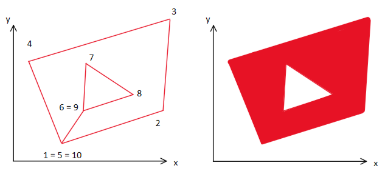
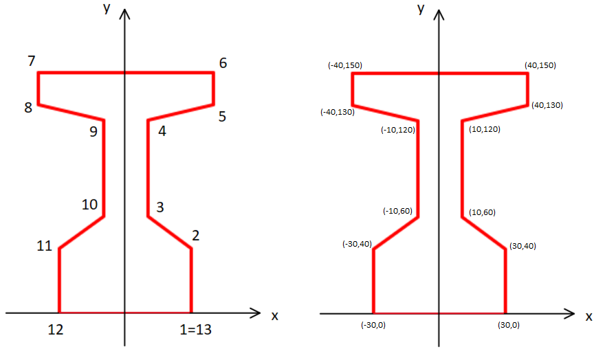
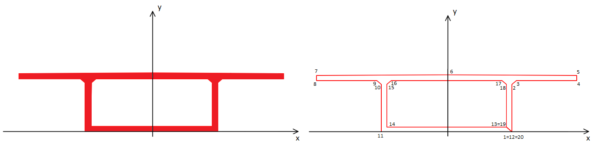

<h1>Propriedades Geométricas</h1>

<p>Esta documentação tem o objetivo de contextualizar com relação ao projeto  <i>geometric_props_py</i>. Serão abordados os seguintes tópicos:</p>

<ol>
  <li>O que é / objetivo do projeto</li>
  <li>Introdução</li>
  <li>Sistema de Arquivos</li>
  <li>Como executar a aplicação</li>
  <li>Tecnologias Utilizadas</li>
  <li>Exemplos</li>
  <li>Licença de Uso</li>
  <li>Autores</li>
  <li>Referências bibliográficas</li>
</ol>


<h2>1 - O que é / objetivo do projeto</h2>
<p>O projeto tem como objetivo calcular um conjunto de propriedades geométricas de figuras poligonais inseridas em um plano bidimensional. Nesse projeto, implementa-se uma classe utilizando a linguagem de programação python que abstrai a metodologia utilizada no teorema de green, que transforma integrais de superfície em integrais de linha ao longo de um contorno para assim, calcular as seguintes propriedades geométricas:</p>

Observação: As unidades disponibilizadas na tabela são válidas quando se insere as coordenadas da figura poligonal em centímetros (cm).

| Propriedades Geométricas                                                                      | Sigla          | Unidade |
| :---                                                                                          | :---:          | :---:   |
| Área da seção                                                                                 | A              | cm²     |
| Momento estático com relação ao eixo x                                                        | S<sub>x</sub>  | cm³     |
| Momento estático com relação ao eixo y                                                        | S<sub>y</sub>  | cm³     |
| Momento de inércia com relação ao eixo x                                                      | I<sub>x</sub>  | cm⁴     |
| Momento de inércia com relação ao eixo y                                                      | I<sub>y</sub>  | cm⁴     |
| Produto da inércia em relação aos eixos x e y                                                 | I<sub>xy</sub> | cm⁴     |
| Centróide da seção em relação ao eixo x                                                       | x<sub>g</sub>  | cm      |
| Centróide da seção em relação ao eixo y                                                       | y<sub>g</sub>  | cm      |
| Momento de inércia baricêntrica (com relação ao centróide) no eixo x                          | I<sub>xg</sub> | cm⁴     |
| Momento de inércia baricêntrica (com relação ao centróide) no eixo x                          | I<sub>xg</sub> | cm⁴     |
| Distância vertical entre o centro de gravidade e o ponto mais baixo ao longo do eixo vertical | Y<sub>1</sub>  | cm      |
| Distância vertical entre o ponto mais alto ao longo do eixo vertical e o centro de gravidade  | Y<sub>2</sub>  | cm      |
| Módulo resistente, calculado considerando Y<sub>1</sub>                                       | W<sub>1</sub>  | cm³     |
| Módulo resistente, calculado considerando Y<sub>2</sub>                                       | W<sub>2</sub>  | cm³     |
| Altura                                                                                        | height         | cm      |

<br>

<p>Além disso, a aplicação permite também obter mais algumas informações relevantes, como:</p>


| Informação                                    | Sigla           | Unidade |
| :---                                          | :---:           | :---:   |
| Coordenada máxima com relação ao eixo x       | x<sub>max</sub> | cm²     |
| Coordenada mínima com relação ao eixo x       | x<sub>min</sub> | cm      |
| Coordenada máxima com relação ao eixo y       | y<sub>max</sub> | cm      |
| Coordenada mínima com relação ao eixo y       | y<sub>min</sub> | cm      |


<h2>2 - Introdução</h2>

<p>A aplicação permite que se trabalhe com figuras vazadas, mas deve-se atentar aos seguintes cuidados, a inserção de uma seção se da a medida que os vértices são inseridos no sentido anti-horário, enquanto a remoção de uma seção se da a medida que seus vértices são inseridos no sentido horário.</p>

<p>No exemplo introdutório a seguir, deseja-se calcular as propriedades de uma figura com 4 vértices, essa figura não apresenta seção vazada (sua seção é maciça). Deve-se tomar cuidado com a ordem de inserção dos vértices. O primeiro ponto é marcado com o número 1, o segundo com o número 2 e assim por diante. Nota-se que é necessário reinserir o ponto inicial, de tal forma que a coordenadas do eixo x e y do primeiro ponto e do último ponto são as mesmas. Na imagem a seguir, é apresentado na esquerda uma imagem que indica a ordem correta de inserção dos pontos, já na direita temos um exemplo de um erro comum que é utilizar o sentido errado na inserção dos pontos.</p>


<br>
<p>A seguir será apresentada uma figura em que sua seção é vazada, nesse caso, a ordem dos pontos será:</p>



<h2>3 - Sistema de arquivos</h2>

No projeto, há 4 pastas e os arquivos de documentação <i>README.md</i>, o arquivo de configurações de dependências <i>package.json</i> e o arquivo com instruções para o compilador <i>tsconfig.json</i>

```
├── dir
│ ├── GeometricProps.js
│ └── ...
├── examples
│ ├── exemple01.js
│ ├── example02.js
│ └── example03.js
├── images
│ └── ...
├── src
│ ├── interfaces
│ └── GeometricProps.ts
├── README.MD
```

<h4>Pastas:</h4>

<p>
<b>dir:</b> Nessa pasta estão os arquivos do projetos já compilados, de typescript para javascript, a classe para o cálculo das propriedades geométricas é GeometricProps.js<br>
<b>examples:</b> Nessa pasta estão contidos os exemplos que estão no tópico 6, o exemplo 1 para a seção retangular, o exemplo 2 para a seção em T com mísulas e o exemplo 3 da seção caixão<br>
<b>images:</b> Nesta pasta estão contidas as imagens que foram inseridas no README.MD, são imagens apenas de caráter explicativo e não são utilizadas na aplicação.<br>
<b>src:</b> Nessa pasta está contido a classe para calcular as propriedades geométricas e as reespectivas interfaces necessárias, nesse caso, temos o projeto em typescript, a classe para o cálculo das propriedades geométricas é GeometricProps.ts
</p>

<h2>4 - Como executar a aplicação</h2>

<p>O único arquivo necessário para executar a aplicação é o arquivo <i>GeometricProps.js</i>, esse arquivo está dentro da pasta dir, e a classe contida nele deve ser importada afim de executar a aplicação.

<p>O primeiro passo para executar a aplicação é realizar a importação da classe contida no arquivo <i>geometricProps.js</i>. Caso a instância da classe está contida na pasta exemplo deve-se inserir:</p>

```
import GeometricProps from "../dir/GeometricProps.js";
```

<p>A próxima etapa é criar uma instância da classe, nesse caso, é esperado no argumento um vetor de objetos, cada objeto deve contar a propriedade x, que faz referência a coordenada no eixo x, e deve conter também a propriedade y, que faz referência a coordenada no eixo y. Cada vértice da figura está estritamente relacionado a uma posição do vetor, em que dentro está contido um objeto que necessita da possição do vértice em relação ao eixo x e em relação ao eixo y. Ao instanciar a classe, a seguinte estrutura deve ser fornecida:</p>

No caso a seguir, queremos representar uma figura retangular com base de 20cm e altura de 60cm, em que a quina inferior esquerda está situada nas coordenadas (0,0). A tabela e a figura a seguir, representam a situação em questão:


| Ponto  | Coordenada no eixo x | Coordenada no eixo y |
| :---:  | :---:                | :---:                |
| 1      | 0                    | 0                    |
| 2      | 20                   | 0                    |
| 3      | 20                   | 60                   |
| 4      | 0                    | 60                   |
| 5      | 0                    | 0                    |

<br>

<p>A imagem ilustrativa que representa a situação descrita na tabela é apresentada a seguir:</p>

  


<br>

<p>Após ter realizado a importação da classe, deve-se criar uma instância e atribuir em uma variável. Nesse caso, será criada a variável <code>rectangulo</code> e atribuida a instância da classe que espera receber no seu construtor, um vetor indicado por <code>[]</code> e cada posição desse vetor deve ser um objeto indicado por <code>{}</code>. Dentro desse dicionário, será inserido um conjunto chave, valor que faz referência ao eixo (x ou y) e ao valor de referência.
</p>

```
const rectangulo = new GeometricProps(
    [
        {'x':0, 'y':0},           ##ponto 1
        {'x':20, 'y':0},          ##ponto 2
        {'x':20, 'y':60},         ##ponto 3
        {'x':0, 'y':60},          ##ponto 4
        {'x':0, 'y':0}            ##ponto 5
    ])
```
  
<p>Após ter instanciado a classe corretamente, já é possível acessar todas as propriedades descritas na tabela de proprieades geométricas, cada propriedade geométrica é uma respectiva propriedade da classe. A seguir será apresentado o nome da propriedade da classe e sua propriedade geométrica correspondente.</p>

<h3>Nome da propriedade geométrica e respectiva propriedade da classe:</h3>

<table border="1">
  <thead>
  <th>Propriedade Geométrica</th>
    <th>Propriedade da classe</th>
  </thead>

  <tbody>
    <tr>
      <td>Área da seção (A)</td>
      <td align="center">rectangulo.A</td>
    </tr>
    <tr>
      <td>Momento estático com relação ao eixo x (S<sub>x</sub>)</td>
      <td align="center">rectangulo.Sx</td>
    </tr>
    <tr>
      <td>Momento estático com relação ao eixo y (S<sub>y</sub>)</td>
      <td align="center">rectangulo.Sy</td>
    </tr>
    <tr>
      <td>Momento de inércia com relação ao eixo x (I<sub>x</sub>)</td>
      <td align="center">rectangulo.Ix</td>
    </tr>
    <tr>
      <td>Momento de inércia com relação ao eixo y (I<sub>y</sub>)</td>
      <td align="center">rectangulo.Iy</td>
    </tr>
    <tr>
      <td>Produto da inércia em relação aos eixos x e y (I<sub>xy</sub>)</td>
      <td align="center">rectangulo.Ixy</td>
    </tr>
    <tr>
      <td>Centróide da seção em relação ao eixo x (x<sub>g</sub>)</td>
      <td align="center">rectangulo.Xg</td>
    </tr>
    <tr>
      <td>Centróide da seção em relação ao eixo y (y<sub>g</sub>)</td>
      <td align="center">rectangulo.Yg</td>
    </tr>
    <tr>
      <td>Momento de inércia baricêntrica (com relação ao centróide) no eixo x (I<sub>xg</sub>)</td>
      <td align="center">rectangulo.Ixg</td>
    </tr>
    <tr>
      <td>Momento de inércia baricêntrica (com relação ao centróide) no eixo y (I<sub>yg</sub>)</td>
      <td align="center">rectangulo.Iyg</td>
    </tr>
    <tr>
      <td>Produto de inércia com relação ao centróide em x e y (I<sub>xyg</sub>)</td>
      <td align="center">rectangulo.Ixyg</td>
    </tr>
    <tr>
      <td>Distância vertical entre o centro de gravidade e o ponto mais baixo ao longo do eixo vertical (Y<sub>1</sub>)</td>
      <td align="center">rectangulo.Y1</td>
    </tr>
    <tr>
      <td>Distância vertical entre o ponto mais alto ao longo do eixo vertical e o centro de gravidade (Y<sub>2</sub>)</td>
      <td align="center">rectangulo.Y2</td>
    </tr>
    <tr>
      <td>Módulo resistente, calculado considerando Y<sub>1</sub> (W<sub>1</sub>)</td>
      <td align="center">rectangulo.W1</td>
    </tr>
    <tr>
      <td>Módulo resistente, calculado considerando Y<sub>2</sub> (W<sub>2</sub>)</td>
      <td align="center">rectangulo.W2</td>
    </tr>
    <tr>
      <td>Altura (h)</td>
      <td align="center">rectangulo.height</td>
    </tr>
  </tbody>
</table>

<h3>Acessando cada propriedade geométrica e demais informações</h3>

<p>Abaixo, será apresentado o <code>print()</code> referente a cada uma das propriedades geométricas, a função <code>round()</code> auxilia para que seja apresentado o resultado com 2 casas decimais. </p>

```

console.log(`
Xmax: ${rectangulo.Xmax.toFixed(2)} cm,
Xmin: ${rectangulo.Xmin.toFixed(2)} cm,
Ymax: ${rectangulo.Ymax.toFixed(2)} cm,
Ymin: ${rectangulo.Ymin.toFixed(2)} cm,
A: ${rectangulo.A.toFixed(2)} cm²,
Sx: ${rectangulo.Sx.toFixed(2)} cm³,
Sy: ${rectangulo.Sy.toFixed(2)} cm³,
Ix: ${rectangulo.Ix.toFixed(2)} cm⁴,
Iy: ${rectangulo.Iy.toFixed(2)} cm⁴,
Ixy: ${rectangulo.Ixy.toFixed(2)} cm⁴,
Xg: ${rectangulo.Xg.toFixed(2)} cm,
Yg: ${rectangulo.Yg.toFixed(2)} cm,
Ixg: ${rectangulo.Ixg.toFixed(2)} cm⁴,
Iyg: ${rectangulo.Iyg.toFixed(2)} cm⁴,
Ixyg: ${rectangulo.Ixyg.toFixed(2)} cm⁴,
Y1: ${rectangulo.Y1.toFixed(2)} cm,
Y2: ${rectangulo.Y2.toFixed(2)} cm,
W1: ${rectangulo.W1.toFixed(2)} cm³,
W2: ${rectangulo.W2.toFixed(2)} cm³,
height: ${rectangulo.height.toFixed(2)} cm,
base: ${rectangulo.base.toFixed(2)} cm,
`)
```

<h2>5 - Tecnologias Utilizadas</h2>

<p>Typescript </p>
<p>Javascript </p>

<h2>6 - Exemplos </h2>


<p>Nesse tópicos serão apresentados exemplos típicos de seções utilizados em sistemas estruturais de aço e madeira, concreto armado e concreto protendido, ou seja, aplicando no contexto da engenharia Civil e engenharia Mecânica (os nomes das seções serão típicos dessas área de conhecimento). Os resultados serão apresentados com 2 casas decimais para fins didáticos.</p>

<p>Todos os exemplos apresentados nesse tópico estão disponíveis na aplicação, em caso de dúvida sobre como acessar os exemplos consulte o <i>tópico sistema de arquivos</i>.</p>

<h3> 5.1 - Seção Retangular</h3>
<p> O primeiro exemplo será a seção retangular apresentada no tópico 'Como executar a aplicação', nesse exemplo será reapresentada a imagem que descreve o polígono retangular e será apresentado também os resultados das propriedade geométricas.

<br>

<br>
<br>
<p>
A imagem a seguir apresenta o trecho de código para realizar o <code>console.log()</code> e o resultado no terminal:
</p>
  
<br>


<h3> 5.2 - Seção T com mísulas</h3>

<p>Nessa próxima seção, é apresentado um polígono convencional para concreto protendido que é a seção T com mísulas. Nesse caso teremos os seguintes pontos: </p>  




<p>O código apresentado do polígono em questão é apresentado abaixo:</p>

```
const sectionTWithCorbels = new GeometricProps(
    [
        {'x':30, 'y':0}, 
        {'x':30, 'y':40},
        {'x':10, 'y':60},
        {'x':10, 'y':120},
        {'x':40, 'y':130},
        {'x':40, 'y':150},
        {'x':-40, 'y':150},
        {'x':-40, 'y':130},
        {'x':-10, 'y':120},
        {'x':-10, 'y':60},
        {'x':-30, 'y':40},
        {'x':-30, 'y':0},
        {'x':30, 'y':0},
    ])
```

<p>
A imagem a seguir apresenta o trecho de código para realizar o <code>console()</code> e o resultado no terminal:
</p>


<h3> 5.2 - Seção Caixão</h3>

<p>A próxima seção é muito utilizada em sistemas estruturais em concreto protendido, e tem a característica de ter seção vazada.</p>



<br>

<p>As coordenadas são:</p>

| Ponto  | Coordenada no eixo x | Coordenada no eixo y |
| :---   | :---:                | :---:                |
| 1      | 300                  | 0                    |
| 2      | 300                  | 250                  |
| 3      | 320                  | 270                  |
| 4      | 598                  | 270                  |
| 5      | 598                  | 296                  |
| 6      | 0                    | 300                  |
| 7      | -598                 | 296                  |
| 8      | -598                 | 270                  |
| 9      | -320                 | 270                  |
| 10     | -300                 | 250                  |
| 11     | -300                 | 0                    |
| 12     | 300                  | 0                    |
| 13     | 275                  | 25                   |
| 14     | -275                 | 25                   |
| 15     | -275                 | 250                  |
| 16     | -255                 | 270                  |
| 17     | 255                  | 270                  |
| 18     | 275                  | 250                  |
| 19     | 275                  | 25                   |
| 20     | 300                  | 0                    |

<br>

<p>O código da instância da classe é apresentado a seguir:</p>

```
const sectionBox = new GeometricProps(
    [
        {'x':300, 'y':0}, 
        {'x':300, 'y':250},
        {'x':320, 'y':270},
        {'x':598, 'y':270},
        {'x':598, 'y':296},
        {'x':0, 'y':300},
        {'x':-598, 'y':296},
        {'x':-598, 'y':270},
        {'x':-320, 'y':270},
        {'x':-300, 'y':250},
        {'x':-300, 'y':0},
        {'x':300, 'y':0},
        {'x':275, 'y':25},
        {'x':-275, 'y':25},
        {'x':-275, 'y':250},
        {'x':-255, 'y':270},
        {'x':255, 'y':270},
        {'x':275, 'y':250},
        {'x':275, 'y':25},
        {'x':300, 'y':0},
    ])
```

Por fim, o resultado no terminal:


<h2>7 - Licença de Uso</h2>
<p>Neste projeto está sendo utilizado a licença Creative Common CC BY-NC. Esta licença permite que outras pessoas remixem, adaptem e criem a partir do trabalho presente neste repositório, desde que atribuam aos autores presentes no item 8 a devida autoria ou referência em trabalhos acadêmicos. No entanto, não é permitido usar do código presente para fins comerciais sem a permissão dos autores.</p>

<h2>8 - Autores</h2>

<h4>Desenvolvedor: Eng. Bruno Teixeira Santos</h4>
<p>Redes: Sociais:</p>
<a href="https://github.com/Brunoengi">Github:</a> <br>
<a href="https://www.linkedin.com/in/bruno--teixeira/">Linkedin:</a> <br>
<a href="https://www.instagram.com/b.de_bruno/">Instagram:</a> <br>
<a href="https://www.youtube.com/channel/UCini8PeSegCCvsCuzZCfKKA">Youtube:</a> <br>
</p>

<h4>Orientador: Prof. Dr. Mauro de Vasconcellos Real </h4>
<p>Redes Sociais:</p>
<a href="https://github.com/mvreal">Github:</a> <br>
</p>

<h2>9 - Referências Bibliográficas</h2>

<p>FILHO, A. C. Dimensionamento e verificação de seções poligonais de concreto armado submetidas à flexão composta oblíqua, Porto Alegre, Universidade Federal do Rio Grande do Sul/RS, 2014.</p>